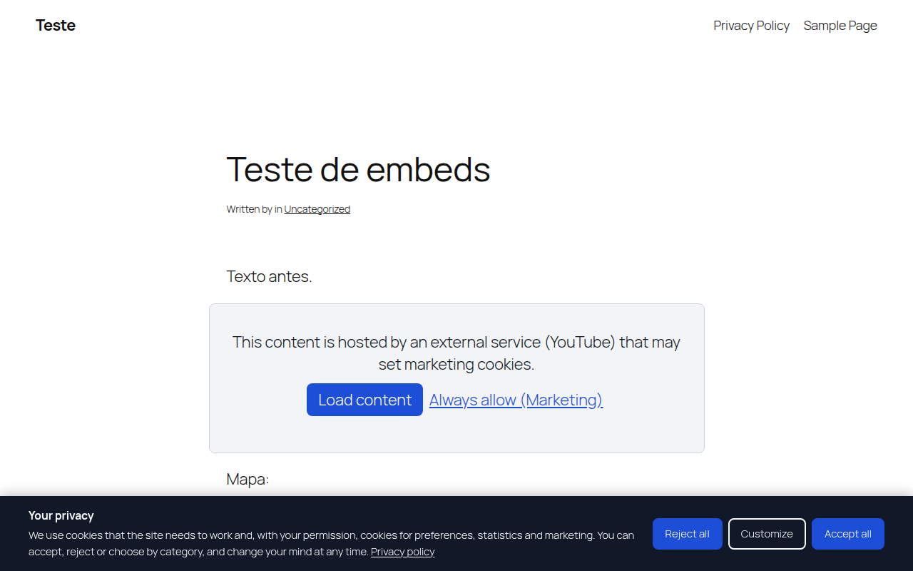

**English** · [Português (Brasil)](README.pt-BR.md)

# privacy-policy-disclaimer-without-wordpress-plugin

[](LICENSE)


Cookie consent for WordPress in a single PHP file that you include from the
theme's `functions.php`. You don't need a plugin, and it has no external
service or library. It covers opt-in consent (LGPD, GDPR), opt-out notices
(CCPA/CPRA), Google Consent Mode v2, Global Privacy Control, blocking of
scripts and embeds until consent, and a consent log wired into the
WordPress privacy tools.



## Contents

- [Features](#features)
- [Install](#install)
- [Consent models](#consent-models)
- [Blocking scripts](#blocking-scripts)
- [Embeds](#embeds)
- [Google Consent Mode v2](#google-consent-mode-v2)
- [Consent log and privacy tools](#consent-log-and-privacy-tools)
- [Shortcodes and developer API](#shortcodes-and-developer-api)
- [Page cache](#page-cache)
- [Tests](#tests)
- [Limitations](#limitations)
- [FAQ](#faq)
- [Upgrading from 1.x](#upgrading-from-1x)
- [Contributing](#contributing)
- [Author](#author)
- [License](#license)

## Features

- Three consent models: opt-in (nothing optional runs before consent), opt-out (notice with a "Do Not Sell or Share" option) and automatic, by visitor country.
- Categories: necessary (always on), preferences, statistics and marketing. Each one can be turned off, renamed and described.
- "Reject all" sits on the first layer, next to "Accept all" and with the same style, so neither choice is pushed over the other.
- A preferences dialog with one switch per category, reachable at any time from a floating button, a shortcode or any element with `data-ppd-open`.
- Google Consent Mode v2 (advanced or basic), with optional GTM and GA4 loaders.
- Global Privacy Control: the browser signal is treated as an opt-out of sale and sharing.
- Blocks scripts until consent: code pasted in the settings, enqueued handles, or any `<script type="text/plain" data-ppd-category="...">` in the theme.
- Replaces YouTube, Vimeo, Google Maps, Spotify, SoundCloud, X, Instagram, Facebook, TikTok, Dailymotion, LinkedIn and Calendly embeds with a placeholder that can load that one embed or always allow the category.
- Withdrawing consent deletes the related cookies (configurable prefixes) and reloads the page, because scripts that already ran cannot be stopped.
- Consent log in its own table: random ID, date, choice, policy version, GPC flag and an anonymized, hashed IP. It includes CSV export, retention cleanup and hooks into Tools > Export / Erase Personal Data.
- Changing the policy version asks every visitor again.
- Texts in English and Brazilian Portuguese, picked from the site language. Every text can be edited.
- Accessible: native `<dialog>`, keyboard and screen reader support, 44px touch targets, visible focus, no headings added to the page outline. axe-core reports no WCAG 2.1 AA violations.
- Works with full-page cache (see [Page cache](#page-cache)).

## Install

1. Copy `privacy-policy-disclaimer.php` into your theme folder. Use a child theme, so a theme update does not delete it.
2. Add this line to the theme's `functions.php`:

   ```php
   require_once get_stylesheet_directory() . '/privacy-policy-disclaimer.php';
   ```

3. Open **Settings > Cookies**, pick the consent model, check the privacy policy page (it defaults to the page set in **Settings > Privacy**) and move your tracking codes into the category boxes (see [Blocking scripts](#blocking-scripts)).
4. Open the site in a private window and check the banner, the preferences and your tags (Google Tag Assistant shows the consent state).

If you use a page cache or a CDN, purge it after installing.

## Consent models

| Model | For | Before a choice | Banner buttons |
|---|---|---|---|
| Opt-in | LGPD, GDPR, UK GDPR | Only necessary cookies. Optional scripts and embeds are held. Consent Mode starts denied. | Reject all, Customize, Accept all |
| Opt-out | CCPA/CPRA and other US state laws | Scripts run. Consent Mode starts granted, or ads denied when the browser sends GPC. | Do Not Sell or Share, Got it |
| Automatic | Sites with visitors from several countries | Opt-in for the EU, EEA, UK, Switzerland and Brazil (editable list). Opt-out for the US. Other countries follow a setting, opt-in by default. | Depends on the country |

The automatic model reads the country from the `CF-IPCountry` (Cloudflare), `CloudFront-Viewer-Country`, `X-Country-Code` or GeoIP headers. Without any of them, the visitor gets the setting for unknown countries (opt-in by default). The `ppd_visitor_country` filter lets you plug in another source.

## Blocking scripts

There are three ways to hold a script until the visitor allows its category.

1. **Settings > Cookies > Categories and scripts.** Paste the code (Meta Pixel, Clarity, Hotjar, LinkedIn Insight) into the category box. It is printed inside a `<template>` and only runs after consent. Only users with the `unfiltered_html` capability can save it.
2. **Enqueued scripts.** In **Embeds**, list `handle:category` lines, for example `facebook-pixel:marketing`. The tag gets `type="text/plain"`, so the browser neither downloads nor runs it.
3. **In the theme.** Mark any tag by hand:

   ```html
   <script type="text/plain" data-ppd-category="analytics" src="https://example.com/tag.js"></script>
   <iframe data-ppd-category="marketing" data-ppd-src="https://example.com/widget"></iframe>
   ```

Content added later (AJAX, infinite scroll) follows the current choice.

## Embeds

Iframes and oEmbeds from known providers are replaced by a placeholder that
names the service. "Load content" loads that one embed without saving
anything; "Always allow" grants the category (marketing by default) and loads
every embed on the page. The provider list can be changed with the
`ppd_embed_providers` filter.

## Google Consent Mode v2

The consent defaults are printed first in `<head>`, before any Google tag.
A stored choice is applied in the same script, so returning visitors never
send a denied hit by mistake.

| Category | Consent Mode signals |
|---|---|
| Statistics | `analytics_storage` |
| Marketing | `ad_storage`, `ad_user_data`, `ad_personalization` |
| Preferences | `functionality_storage`, `personalization_storage` |
| Always granted | `security_storage` |

- **Advanced** (default): tags load and wait for consent, sending cookieless pings while denied.
- **Basic**: the GTM or GA4 loader is held until the visitor allows statistics.

Fill the GTM or GA4 ID only if the theme or another tool does not already
add them. `ads_data_redaction` is on by default and `url_passthrough` is
optional. Every choice also pushes a `ppd_consent` event to the dataLayer.

## Consent log and privacy tools

Each choice is stored in `wp_ppd_consent_log` with a random ID, the UTC date,
the model, the action (`accept_all`, `reject_all`, `custom`, `acknowledge`,
`optout`, `gpc`, `embed`), the allowed categories, the policy version, the
GPC flag, the user ID for logged-in users, the page path without query
string, and an HMAC of the anonymized IP. The raw IP is never stored.

- **Settings > Cookies > Consent log** shows the totals and the latest records, and exports everything as CSV.
- Records older than the retention period (730 days by default) are deleted by a daily cron.
- **Tools > Export / Erase Personal Data** include the records of registered users. Anonymous visitors have no link between an email and a record.
- The WordPress privacy policy guide (in **Settings > Privacy**) gets a suggested paragraph for your policy.
- The endpoint has a rate limit of 30 records per IP every 10 minutes.

## Shortcodes and developer API

| Shortcode | Output |
|---|---|
| `[ppd_cookie_settings]` | Button that reopens the preferences (`text` attribute to change the label) |
| `[ppd_do_not_sell]` | "Do Not Sell or Share My Personal Information" button, for the footer |
| `[ppd_cookie_table]` | Table of categories and purposes, for the privacy policy |

```php
// In theme code (pages that are not served from full-page cache).
if ( ppd_has_consent( 'analytics' ) ) { /* ... */ }
$choice = ppd_get_consent(); // null or [ 'v', 'c' => [ category => 0|1 ], 'r', 't', 'id', 'g' ]
```

```js
document.addEventListener('ppd:consent', function (e) {
  console.log(e.detail); // { preferences: 1, analytics: 0, marketing: 0 }
});
```

Filters: `ppd_settings`, `ppd_is_active`, `ppd_is_portuguese`, `ppd_visitor_country`, `ppd_optin_countries`, `ppd_regime_for_country`, `ppd_script_handles`, `ppd_embed_providers`.

## Page cache

The HTML is the same for every visitor, and all decisions run in the browser.
That covers the stored choice, the country lookup (an uncached REST call,
kept for the session) and script activation. Full-page caches such as
LiteSpeed, WP Rocket and Cloudflare can keep caching pages. The REST nonce
is only printed for logged-in users, who usually bypass the cache.

## Tests

`tests/` has the end-to-end suite used to validate this version against a
real WordPress, with 83 checks in Chromium through Playwright plus an axe-core
accessibility pass. The latest run passed all of them. It covers:

- first visit and every banner action;
- stored choice, withdrawal with cookie cleanup and reload;
- policy version bump;
- opt-out, GPC, and the automatic model by country;
- the modal and mobile layouts;
- REST validation and rate limit;
- every settings tab, CSV export, and the privacy exporter and eraser.

The code also passes PHP_CodeSniffer with the WordPress standard.
See [tests/README.md](tests/README.md) to run it.

## Limitations

- This is a technical tool, not legal advice. Whether a site complies depends on its configuration, its privacy policy and what it does with the data.
- The automatic model depends on a country header from the CDN or server. In the US it applies opt-out to the whole country and does not tell states apart.
- Scripts hard-coded by other plugins, that are neither enqueued nor marked, are not blocked. Move them into a category box or add them to the handle list.
- There is no automatic cookie scanner. The categories and cookie prefixes come from your settings.
- No IAB TCF support.

## FAQ

**Is this a plugin?**
No. It is a file loaded by the theme. You get the settings page and the
features of a consent plugin without installing one.

**Does it make my site LGPD or GDPR compliant?**
It gives you the technical pieces: prior consent, granular choice, reject as
easy as accept, withdrawal and a record of consent. Compliance also depends
on your privacy policy and on what the site does with personal data.

**Does it slow the site down?**
It adds no request of its own on the first view. CSS and JS are inline, a
few KB, with no library. The only extra request is the country lookup, and
only in automatic mode.

**How do I ask everyone again after changing the policy?**
In **General**, tick "Ask again" and save. The version goes up and every
stored choice stops counting.

## Upgrading from 1.x

Version 1.x was a small notice ("by using this site, you accept...") pasted
into `footer.php`. Remove that snippet from the theme before adding the new
file. The old code is in the Git history.

## Contributing

Bug reports and suggestions are welcome through [GitHub Issues](https://github.com/LucasFerrazSEO/privacy-policy-disclaimer-without-wordpress-plugin/issues).

## Author

[Lucas Ferraz](https://lucasferraz.com) is an SEO, website development and Generative Engine Optimization specialist and the founder of [Lucas Ferraz SEO](https://lucasferrazseo.com).

## License

MIT. See [LICENSE](LICENSE).
