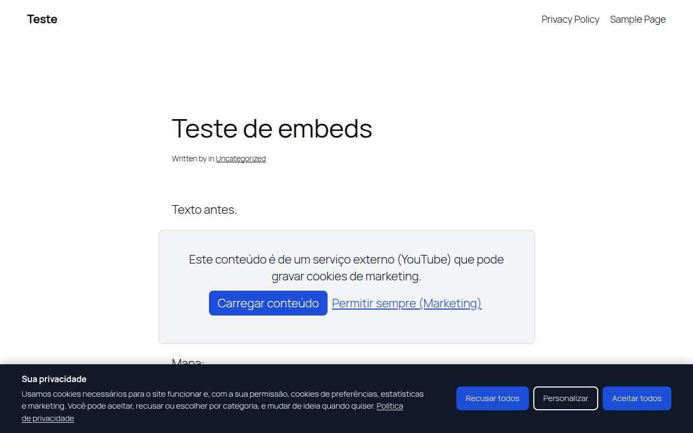
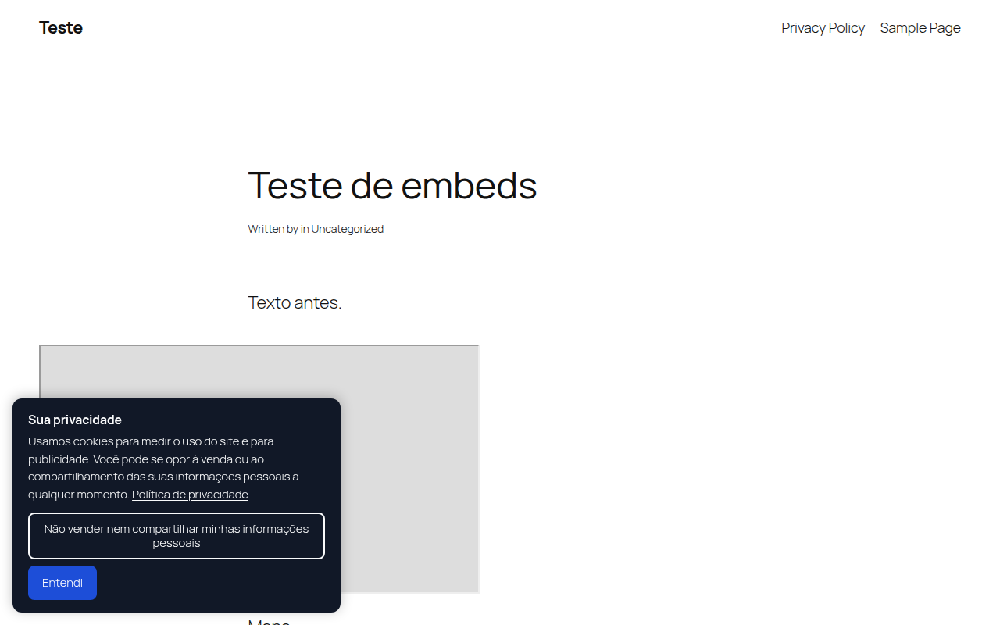

[English](README.md) · **Português (Brasil)**

# Privacy-Policy-Disclaimer-Without-WordPress-Plugin

[](LICENSE)


Consentimento de cookies para WordPress em um único arquivo PHP, incluído
pelo `functions.php` do tema. Não precisa de plugin, serviço externo nem
biblioteca. Cobre o consentimento prévio (LGPD, GDPR), o aviso com opção de
oposição (CCPA/CPRA), o Google Consent Mode v2 e o Global Privacy Control.
Também bloqueia scripts e embeds até o aceite e mantém um registro de
consentimento ligado às ferramentas de privacidade do WordPress.



## Sumário

- [Recursos](#recursos)
- [Instalação](#instalação)
- [Modelos de consentimento](#modelos-de-consentimento)
- [Bloqueio de scripts](#bloqueio-de-scripts)
- [Embeds](#embeds)
- [Google Consent Mode v2](#google-consent-mode-v2)
- [Registro de consentimento e ferramentas de privacidade](#registro-de-consentimento-e-ferramentas-de-privacidade)
- [Shortcodes e API para desenvolvedores](#shortcodes-e-api-para-desenvolvedores)
- [Cache de página](#cache-de-página)
- [Testes](#testes)
- [Limitações](#limitações)
- [Perguntas frequentes](#perguntas-frequentes)
- [Atualizando da versão 1.x](#atualizando-da-versão-1x)
- [Como contribuir](#como-contribuir)
- [Autor](#autor)
- [Licença](#licença)

## Recursos

- Três modelos de consentimento: opt-in (nada opcional roda antes do aceite), opt-out (aviso com a opção "Não vender nem compartilhar") e automático, pelo país do visitante.
- Categorias: necessários (sempre ligados), preferências, estatísticas e marketing. Cada uma pode ser desligada, renomeada e descrita.
- "Recusar todos" fica na primeira camada, ao lado de "Aceitar todos" e com o mesmo estilo, para nenhuma escolha ser empurrada sobre a outra.
- Painel de preferências com uma chave por categoria. O visitante reabre quando quiser pelo botão flutuante, por shortcode ou por qualquer elemento com `data-ppd-open`.
- Google Consent Mode v2 (avançado ou básico), com carregamento opcional do GTM e do GA4.
- Global Privacy Control: o sinal do navegador vale como oposição à venda e ao compartilhamento.
- Segura scripts até o aceite: código colado nas configurações, scripts enfileirados ou qualquer `<script type="text/plain" data-ppd-category="...">` no tema.
- Troca embeds de YouTube, Vimeo, Google Maps, Spotify, SoundCloud, X, Instagram, Facebook, TikTok, Dailymotion, LinkedIn e Calendly por um aviso. No aviso, o visitante carrega só aquele conteúdo ou permite a categoria de vez.
- Ao retirar o consentimento, os cookies da categoria (por prefixo configurável) são apagados e a página recarrega, porque um script que já rodou não tem como ser parado.
- Registro de consentimento em tabela própria: ID aleatório, data, escolha, versão da política, sinal GPC e IP anonimizado com hash. Tem exportação em CSV, limpeza por prazo de retenção e integração com Ferramentas > Exportar / Apagar dados pessoais.
- Mudar a versão da política faz todos os visitantes serem perguntados de novo.
- Textos em português do Brasil e em inglês, escolhidos pelo idioma do site. Todos podem ser editados.
- Acessível: `<dialog>` nativo, teclado e leitor de tela, áreas de toque de 44px, foco visível, sem adicionar títulos à estrutura da página. O axe-core não aponta nenhuma violação WCAG 2.1 AA.
- Funciona com cache de página (veja [Cache de página](#cache-de-página)).



## Instalação

1. Copie `privacy-policy-disclaimer.php` para a pasta do tema. Use um tema filho, senão uma atualização do tema apaga o arquivo.
2. Acrescente esta linha ao `functions.php` do tema:

   ```php
   require_once get_stylesheet_directory() . '/privacy-policy-disclaimer.php';
   ```

3. Abra **Configurações > Cookies**, escolha o modelo de consentimento e confira a página de política de privacidade. O padrão é a página definida em **Configurações > Privacidade**. Depois leve os códigos de rastreamento para as caixas das categorias (veja [Bloqueio de scripts](#bloqueio-de-scripts)).
4. Abra o site em uma janela anônima e confira o banner, as preferências e as tags. O Google Tag Assistant mostra o estado do consentimento.

Se o site usa cache de página ou CDN, limpe o cache depois de instalar.

## Modelos de consentimento

| Modelo | Para | Antes da escolha | Botões do banner |
|---|---|---|---|
| Opt-in | LGPD, GDPR, UK GDPR | Só cookies necessários. Scripts e embeds opcionais ficam segurados. O Consent Mode começa negado. | Recusar todos, Personalizar, Aceitar todos |
| Opt-out | CCPA/CPRA e outras leis estaduais dos EUA | Os scripts rodam. O Consent Mode começa concedido, ou com anúncios negados quando o navegador envia GPC. | Não vender nem compartilhar, Entendi |
| Automático | Sites com visitantes de vários países | Opt-in para UE, EEE, Reino Unido, Suíça e Brasil (lista editável). Opt-out para os EUA. Os demais países seguem uma configuração, opt-in por padrão. | Depende do país |

O modelo automático lê o país nos cabeçalhos `CF-IPCountry` (Cloudflare), `CloudFront-Viewer-Country`, `X-Country-Code` ou do GeoIP. Sem nenhum deles, vale a configuração para país desconhecido (opt-in por padrão). O filtro `ppd_visitor_country` permite usar outra fonte.

## Bloqueio de scripts

Há três jeitos de segurar um script até o visitante permitir a categoria dele.

1. **Configurações > Cookies > Categorias e scripts.** Cole o código (Meta Pixel, Clarity, Hotjar, LinkedIn Insight) na caixa da categoria. Ele sai dentro de um `<template>` e só roda depois do aceite. Só usuários com a permissão `unfiltered_html` conseguem salvar.
2. **Scripts enfileirados.** Na aba **Embeds**, liste linhas `handle:categoria`, por exemplo `facebook-pixel:marketing`. A tag recebe `type="text/plain"`, então o navegador não baixa nem executa.
3. **No tema.** Marque qualquer tag à mão:

   ```html
   <script type="text/plain" data-ppd-category="analytics" src="https://example.com/tag.js"></script>
   <iframe data-ppd-category="marketing" data-ppd-src="https://example.com/widget"></iframe>
   ```

Conteúdo que entra depois na página (AJAX, rolagem infinita) segue a escolha atual.

## Embeds

Iframes e oEmbeds de serviços conhecidos viram um aviso com o nome do
serviço. "Carregar conteúdo" carrega só aquele item, sem gravar nada.
"Permitir sempre" libera a categoria (marketing, por padrão) e carrega todos
os embeds da página. A lista de serviços muda pelo filtro `ppd_embed_providers`.

## Google Consent Mode v2

O estado padrão de consentimento é o primeiro script do `<head>`, antes de
qualquer tag do Google. A escolha já gravada é aplicada no mesmo script,
então o visitante que volta ao site nunca envia um hit negado por engano.

| Categoria | Sinais do Consent Mode |
|---|---|
| Estatísticas | `analytics_storage` |
| Marketing | `ad_storage`, `ad_user_data`, `ad_personalization` |
| Preferências | `functionality_storage`, `personalization_storage` |
| Sempre concedido | `security_storage` |

- **Avançado** (padrão): as tags carregam e esperam o consentimento, enviando pings sem cookie enquanto está negado.
- **Básico**: o GTM ou o GA4 só carregam depois que o visitante permite estatísticas.

Preencha o ID do GTM ou do GA4 só se o tema ou outra ferramenta ainda não
inserem as tags. O `ads_data_redaction` vem ligado e o `url_passthrough` é
opcional. Toda escolha também envia um evento `ppd_consent` para o dataLayer.

## Registro de consentimento e ferramentas de privacidade

Cada escolha vai para a tabela `wp_ppd_consent_log`. Cada registro guarda:

- ID aleatório e data em UTC;
- modelo e ação (`accept_all`, `reject_all`, `custom`, `acknowledge`, `optout`, `gpc`, `embed`);
- categorias permitidas, versão da política e sinal GPC;
- ID do usuário, quando está logado;
- caminho da página, sem a query string;
- um HMAC do IP anonimizado. O IP completo nunca é gravado.

- **Configurações > Cookies > Registro de consentimento** mostra os totais e os últimos registros, e exporta tudo em CSV.
- Registros mais antigos que o prazo de retenção (730 dias por padrão) são apagados por um cron diário.
- **Ferramentas > Exportar / Apagar dados pessoais** incluem os registros de usuários cadastrados. Visitantes anônimos não têm ligação entre e-mail e registro.
- O guia de política de privacidade do WordPress (em **Configurações > Privacidade**) ganha um parágrafo sugerido para a sua política.
- O endpoint aceita no máximo 30 registros por IP a cada 10 minutos.

## Shortcodes e API para desenvolvedores

| Shortcode | Resultado |
|---|---|
| `[ppd_cookie_settings]` | Botão que reabre as preferências (atributo `text` muda o rótulo) |
| `[ppd_do_not_sell]` | Botão "Não vender nem compartilhar minhas informações pessoais", para o rodapé |
| `[ppd_cookie_table]` | Tabela de categorias e finalidades, para a política de privacidade |

```php
// No código do tema (páginas que não saem do cache de página inteira).
if ( ppd_has_consent( 'analytics' ) ) { /* ... */ }
$escolha = ppd_get_consent(); // null ou [ 'v', 'c' => [ categoria => 0|1 ], 'r', 't', 'id', 'g' ]
```

```js
document.addEventListener('ppd:consent', function (e) {
  console.log(e.detail); // { preferences: 1, analytics: 0, marketing: 0 }
});
```

Filtros: `ppd_settings`, `ppd_is_active`, `ppd_is_portuguese`, `ppd_visitor_country`, `ppd_optin_countries`, `ppd_regime_for_country`, `ppd_script_handles`, `ppd_embed_providers`.

## Cache de página

O HTML é o mesmo para todo visitante, e todas as decisões rodam no
navegador. Isso vale para a escolha gravada, a consulta do país (uma chamada
REST sem cache, guardada durante a sessão) e a ativação dos scripts. Caches
de página inteira como LiteSpeed, WP Rocket e Cloudflare podem continuar
ligados. O nonce da REST só é impresso para usuários logados, que em geral
não passam pelo cache.

## Testes

A pasta `tests/` tem a bateria usada para validar esta versão em um
WordPress real: 83 checagens no Chromium via Playwright e mais uma passada de
acessibilidade com o axe-core. A última execução passou em todas. Ela cobre:

- primeira visita e cada botão do banner;
- escolha gravada, retirada com limpeza de cookies e recarga;
- troca de versão da política;
- opt-out, GPC e o modelo automático por país;
- os layouts em janela central e no celular;
- validação da REST e o limite de registros;
- cada aba das configurações, a exportação em CSV e a exportação e a exclusão de dados pessoais.

O código também passa no PHP_CodeSniffer com o padrão do WordPress.
Veja [tests/README.md](tests/README.md) para rodar.

## Limitações

- É uma ferramenta técnica, não um parecer jurídico. A adequação do site depende da configuração, da política de privacidade e do que o site faz com os dados.
- O modelo automático depende de um cabeçalho de país vindo da CDN ou do servidor. Nos EUA, aplica opt-out ao país inteiro e não distingue estados.
- Scripts escritos direto no HTML por outros plugins, sem enfileiramento nem marcação, não são segurados. Leve esses scripts para uma caixa de categoria ou para a lista de handles.
- Não há varredura automática de cookies. Categorias e prefixos de cookie vêm das suas configurações.
- Não tem suporte ao IAB TCF.

## Perguntas frequentes

**Isto é um plugin?**
Não. É um arquivo carregado pelo tema. Você tem a página de configurações e
os recursos de um plugin de consentimento sem instalar nenhum.

**Deixa o site adequado à LGPD ou ao GDPR?**
Entrega as peças técnicas: consentimento prévio, escolha por categoria,
recusar tão fácil quanto aceitar, retirada do consentimento e registro de
prova. A adequação também depende da política de privacidade e do que o site
faz com os dados pessoais.

**Deixa o site mais lento?**
Não adiciona nenhuma requisição própria no primeiro acesso. O CSS e o JS vão
embutidos, com poucos KB e sem biblioteca. A única requisição a mais é a
consulta do país, e só no modelo automático.

**Como pedir o consentimento de todos de novo depois de mudar a política?**
Na aba **Geral**, marque "Pedir de novo" e salve. A versão sobe e nenhuma
escolha antiga continua valendo.

## Atualizando da versão 1.x

A versão 1.x era um aviso simples ("ao usar este site, você aceita...")
colado no `footer.php`. Tire esse trecho do tema antes de incluir o arquivo
novo. O código antigo continua no histórico do Git.

## Como contribuir

Relatos de erro e sugestões são bem-vindos pelas [Issues do GitHub](https://github.com/LucasFerrazSEO/Privacy-Policy-Disclaimer-Without-WordPress-Plugin/issues).

## Autor

[Lucas Ferraz](https://lucasferraz.com) é especialista em SEO, criação de sites e Generative Engine Optimization, e fundador da [Lucas Ferraz SEO](https://lucasferrazseo.com).

## Licença

MIT. Veja [LICENSE](LICENSE).
